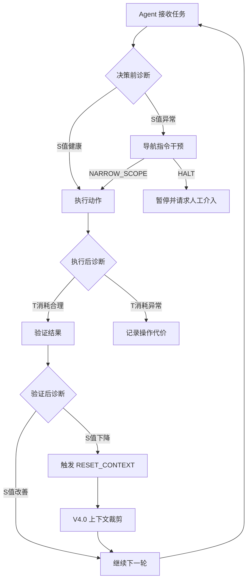

# 🧭 认知导航（Cognitive Navigation）

**单Agent运行时安全诊断框架 · v4.0 MVP**

---

## 📦 项目概述

认知导航是为单个AI Agent设计的运行时安全诊断系统，提供实时健康度评估、全链路追踪和会话级上下文压缩能力。

**v4.0 核心新增**：V4.0 上下文压缩引擎（Loop 2），实现智能分级裁剪，在保留诊断功能的前提下，显著降低 Token 成本。

---

## 🏗️ 架构总览

认知导航以轻量级 Hook 形式嵌入 Agent 执行循环，在三个关键节点进行实时诊断：



> **Hook 注入点说明**：
> - **① 决策前**：当前S值是否健康？决定是否允许执行。
> - **② 执行后**：T消耗是否合理？记录操作代价。
> - **③ 验证后**：S值是否改善？判断操作是否有效。

---

## 🎯 核心能力

| 能力 | 说明 |
|------|------|
| **实时诊断** | T/C/D/S 健康度计算 + 四色警戒区 + 导航指令 |
| **Langfuse 追踪** | 全链路 Trace 自动上报，实时可视化 |
| **V4.0 上下文压缩** | 智能分级裁剪，大幅降低 Token 成本 |
| **多轮会话记忆** | session_id 实现多轮对话上下文保持 |
| **多会话隔离** | 不同 session 完全隔离，互不干扰 |
| **S_memory 监控** | 记忆健康度实时反馈 |
| **FastAPI 服务** | RESTful API + Swagger 文档 |
| **批量诊断** | `/batch-diagnosis` 接口 |

---

## 📊 真实 Agent 测试结果（摘要）

| 测试场景 | 关键信息保留率 | Token 压缩 | 对齐率 |
|----------|--------------|-----------|--------|
| 客服长会话（50轮） | **>90%** | **~60%** | **100%** |
| 编程协作（8 Agent） | — | ~40% | 100% |

**核心结论**：V4.0 与实时诊断无缝连接，在保留核心诊断输出的前提下，实现显著的 Token 成本优化。

---

## 🚀 快速开始

### 1. 克隆仓库

```bash
git clone https://github.com/wwreixi/agent-trace-diagnostics.git
cd agent-trace-diagnostics
```

### 2. 安装依赖

```bash
python -m venv venv
source venv/bin/activate  # Windows: venv\Scriptsctivate
pip install -r requirements.txt
```

### 3. 配置环境变量

```bash
cp .env.example .env
# 编辑 .env，填入你的 API Key
```

### 4. 启动服务

```bash
uvicorn main:app --reload --host 0.0.0.0 --port 8000
```

### 5. 调用 API

```bash
curl -X POST "http://localhost:8000/diagnosis"   -H "Content-Type: application/json"   -d '{"query": "2026年AI安全法规有哪些最新进展？", "session_id": "test_001"}'
```

### 6. 查看 Swagger 文档

```
http://localhost:8000/docs
```

---

## 🔗 相关项目

- [AI群协作导航](https://github.com/wwreixi/multi-agent-collaboration-navigation) — 多Agent群协作合规质量验证与实时干预

---

## 📄 License

MIT

---

## 📮 联系方式

- 作者：wwreixi
- 邮箱：wwreixi@163.com
- GitHub：[@wwreixi](https://github.com/wwreixi)
